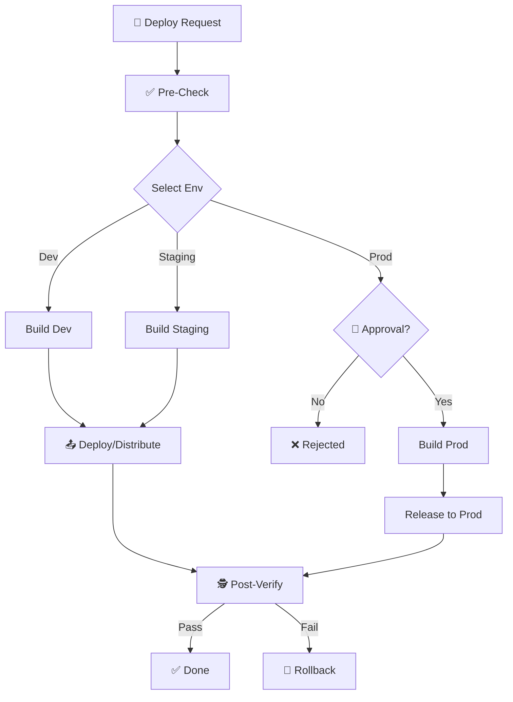

# 🚀 Deploy Application

**Objective:** Guide safe build and deploy process with version control and rollback plan.

## 🖼️ Process Flow



## ⚠️ Prerequisites

> [!IMPORTANT]
> Before deploying, ensure `/prepare-release` checklist is complete

**Required checks:**
- [ ] Code merged to target branch (develop/main)
- [ ] All tests passed (`[Test Command]`)
- [ ] Version bumped (Manifest file)
- [ ] CHANGELOG.md updated

## 🎯 Environment Selection

| Environment | Branch | Purpose | Auto/Manual |
|:--|:--|:--|:--:|
| **Development** | `develop` | Internal testing | Auto |
| **Staging** | `release/*` | UAT, Client preview | Manual |
| **Production** | `main` | End users | Manual + Approval |

## 🚀 Deployment Steps

### 1. Build Application

```bash
# Development
make build-dev

# Staging  
make build-staging

# Production
make build-prod
```

### 2. Verify Build Artifacts
- [ ] Artifact size reasonable (no sudden increase)
- [ ] Version number correct
- [ ] Bundle ID/Package name matches environment

### 3. Upload & Distribute

#### Android
```bash
# Firebase App Distribution (Dev/Staging)
make distribute-android ENV=staging

# Google Play (Production)
make upload-playstore TRACK=internal
```

#### iOS
```bash
# TestFlight (Dev/Staging)
make distribute-ios ENV=staging

# App Store (Production)
make upload-appstore
```

### 4. Post-Deploy Verification
- [ ] App accessible/installable
- [ ] Smoke test main features
- [ ] Check logs (Error Reporting Tool)
- [ ] Monitor API errors

## 🔄 Rollback Plan

If critical issues found after deploy:

### Immediate Actions
1. **Halt Distribution:** Stop distributing new version
2. **Notify Team:** Alert about incident
3. **Assess Impact:** Evaluate affected users

### Rollback Steps
```bash
# Revert to previous version
git checkout tags/v{PREVIOUS_VERSION}
make build-prod
make deploy-prod --rollback
```

## 📋 Deployment Checklist

### Pre-Deploy
- [ ] Feature complete and tested
- [ ] No blocking bugs
- [ ] Release notes prepared
- [ ] Stakeholder approval (Production only)

### Post-Deploy
- [ ] Verify installation
- [ ] Smoke tests passed
- [ ] No spike in crash rate
- [ ] Tag release in Git

## 💡 AI Guidelines

**Language:** All responses and reports must be in **Vietnamese**, even though this workflow is written in English.

- Don't auto-deploy Production - guide steps only
- Always remind user about rollback plan
- Check for version mismatches before proceeding
- Log all deployments to CHANGELOG
