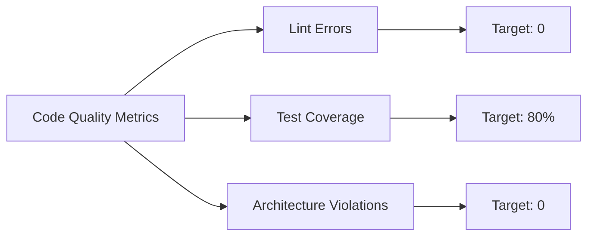
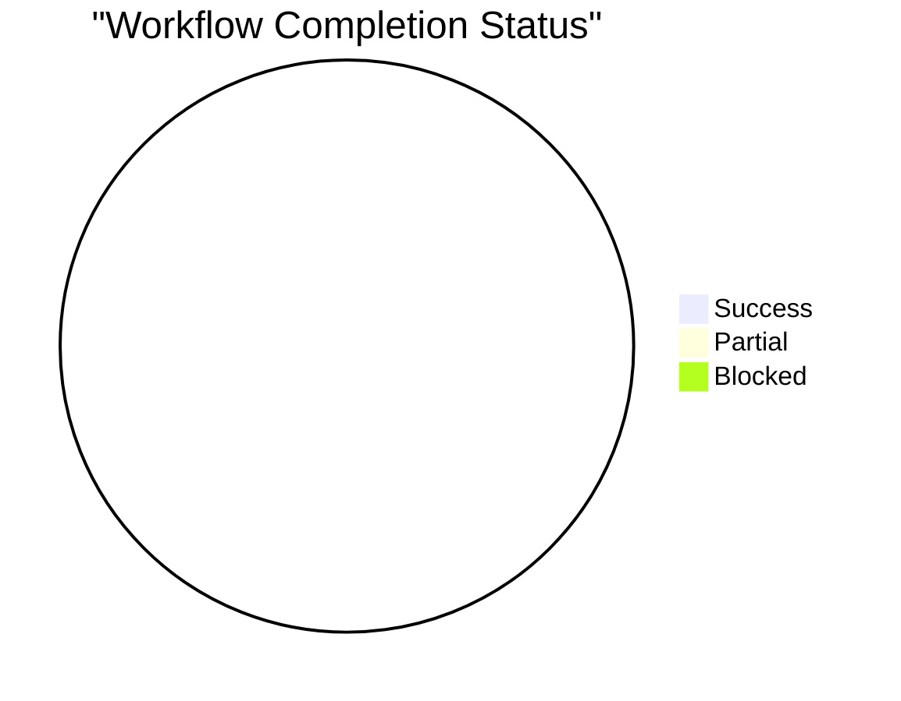

# 📊 AI Workflow Metrics Dashboard

> **Version:** 2.4.1 | **Last Updated:** 2026-01-26 | **Period:** 2026-Q1

Theo dõi hiệu suất và insights của AI Development Workflow.

---

## 📈 Overview Dashboard

### Current Period Stats (January 2026)

| Metric | Value | Trend |
|:---|---:|:---:|
| Total Workflows Executed | 0 | - |
| Success Rate | N/A | - |
| Avg Completion Time | N/A | - |
| Knowledge Base Entries | 5 | → |
| Active Skills | 16 | → |

---

## 🏆 Workflow Leaderboard

### Top 10 Most Used Workflows

| Rank | Workflow | Uses | Success Rate | Avg Duration |
|:---:|:---|---:|:---:|:---:|
| 🥇 | `/start-task` | - | - | - |
| 🥈 | `/implement-feature` | - | - | - |
| 🥉 | `/review-code` | - | - | - |
| 4 | `/investigate` | - | - | - |
| 5 | `/fix` | - | - | - |
| 6 | `/review-pr` | - | - | - |
| 7 | `/write-test` | - | - | - |
| 8 | `/design-feature` | - | - | - |
| 9 | `/setup-agent` | - | - | - |
| 10 | `/refactor` | - | - | - |

---

## 🎯 Quality Metrics

### Code Quality Trends



| Metric | Current | Target | Status |
|:---|---:|---:|:---:|
| Lint Errors Caught | - | 0 | ⏳ |
| Test Coverage | - | 80% | ⏳ |
| Architecture Violations | - | 0 | ⏳ |
| Code Reviews Completed | - | 100% | ⏳ |

---

## ⚡ Performance Insights

### Atomic Execution Effectiveness

| Metric | Count | Notes |
|:---|---:|:---|
| Tasks Broken Down | - | Files > 150 lines split into sub-tasks |
| Code Gen Checkpoints | - | Paused for `make gen` execution |
| User Clarifications | - | Workflow paused for user input |
| Backtrack Incidents | - | Changed approach mid-execution |

### Workflow Efficiency



---

## 🧠 Learning Metrics

### Knowledge Base Growth

| Month | New Entries | Categories | Top Tags |
|:---|---:|---:|:---|
| 2026-01 | 0 | - | - |
| 2025-12 | 5 | Technical, Business, Pattern | `navigation`, `state`, `performance` |

### Skills Invocation Frequency

| Skill | Uses | Success Rate | Common Use Cases |
|:---|---:|:---:|:---|
| feature-architect | - | - | Feature design, layer breakdown |
| code-reviewer | - | - | PR review, DoD validation |
| bug-investigator | - | - | Root cause analysis |
| flutter-expert | - | - | Performance optimization |
| tech-lead | - | - | Architecture decisions |

---

## 🔄 Workflow Chain Patterns

### Common Sequences

```mermaid
graph TD
    A[/start-task] --> B{Mode?}
    B -->|Standard| C[/write-spec]
    B -->|Hotfix| D[/investigate]
    
    C --> E[/design-feature]
    E --> F[/implement-feature]
    F --> G[/write-test]
    G --> H[/review-code]
    
    D --> I[/fix]
    I --> J[/write-test]
    J --> H
```

### Pattern Analysis

| Pattern | Frequency | Avg Duration | Notes |
|:---|---:|:---:|:---|
| Investigate → Fix → Test | - | - | Bug resolution flow |
| Design → Implement → Test | - | - | Feature development flow |
| Review-PR → Fix → Review | - | - | Code review iteration |

---

## 📝 How to Update

### Manual Logging
After completing a workflow, update [`usage-patterns.md`](file:///Users/tuanvm/Desktop/gmo/kansuke/development-workflow/memory/usage-patterns.md) with execution details.

### Monthly Aggregation
Cuối mỗi tháng:
1. Tổng hợp data từ `usage-patterns.md`
2. Cập nhật các bảng và charts trong file này
3. Phân tích trends và patterns
4. Document insights thu được

### Automated Collection (Future)
Template này ready cho automation. Metrics có thể được collect tự động qua:
- CI/CD pipeline integration
- Git commit analysis
- Workflow execution hooks
- AI agent logging

---

## 🎯 Actionable Insights

### Current Focus Areas
- 🔍 **Data Collection:** Start logging workflow executions
- 📊 **Baseline:** Establish initial metrics for comparison
- 🎯 **Targets:** Set realistic goals for Q1 2026

### Next Steps
1. Complete 10+ workflows để có baseline data
2. Identify top 3 blockers
3. Document 2-3 common workflow patterns
4. Review metrics monthly
