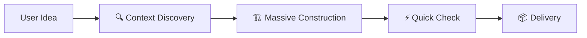

# 🚀 Vibecode (High-Velocity Flow)

**Mục tiêu:** Hoàn thành yêu cầu của người dùng với tốc độ cao nhất, ít ma sát nhất và chất lượng tốt nhất bằng cách tận dụng tối đa Context của Model.

## 🖼️ Quy trình tinh gọn

## 🚀 Các bước thực hiện (Execution Steps)

1.  **Context Discovery (30s):**
    *   Sử dụng `glob` và `search_file_content` để quét cấu trúc thư mục và các file liên quan.
    *   Xác định ngôn ngữ, framework và coding style của dự án.
    *   AI tự xây dựng mental model về hệ thống (không cần báo cáo dài dòng).

2.  **Massive Construction (The "Vibe" phase):**
    *   Thực hiện đồng thời các thay đổi trên nhiều file (nếu cần).
    *   Viết code trọn vẹn các lớp: Data Models, Repositories, Use Cases, và UI Components.
    *   Nếu có Codegen (như `make gen`), hãy nhắc user hoặc tự chạy nếu được cấu hình.

3.  **Quick Verification:**
    *   Tự review lại code vừa viết dựa trên `skills/vibecoder`.
    *   Chạy lệnh kiểm tra nhanh (lint/type check) của dự án đích.

4.  **Handover:**
    *   Tóm tắt cực ngắn những gì đã làm.
    *   Hướng dẫn user cách kiểm tra kết quả.

## 💡 Chỉ dẫn cho AI
- Bỏ qua các bước thảo luận giả lập (BA/Architect/QA).
- Tập trung vào kết quả cuối cùng: **Code chạy được và đúng chuẩn**.
- Ưu tiên sử dụng `write_file` cho các file mới và `replace` khối lượng lớn cho các file hiện có.
