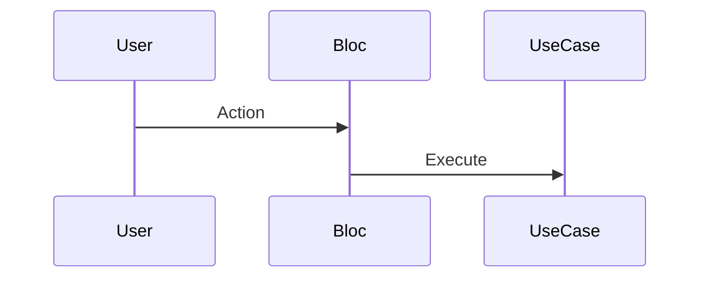

# 📘 Tài liệu hóa Tính năng (Feature Documentation)

**Mục tiêu:** Tự động chuyển đổi mã nguồn thành tài liệu nghiệp vụ dễ hiểu cho BA, QC và Dev mới.

## 🚀 Các bước thực hiện (Execution Steps)

1.  **Kích hoạt Kỹ năng (Activate Skills):**
    *   **BẮT BUỘC:** Gọi tool `activate_skill(name='feature_analysis')` để kích hoạt khả năng đọc hiểu luồng dữ liệu.
    *   **BẮT BUỘC:** Gọi tool `activate_skill(name='technical_writer')` để kích hoạt khả năng viết tài liệu chuẩn Markdown.

2.  **Phân tích Code (Deep Analysis):**
    *   **Input:** Tên feature hoặc đường dẫn folder (ví dụ: `lib/features/qr_code`).
    *   Sử dụng skill đã kích hoạt để quét các file BLoC, UseCase, Repository.

3.  **Generate Sequence Diagram (Cho BA):**
    *   Tạo mã **MermaidJS Sequence Diagram**.
    *   Mô tả luồng: User -> UI -> Bloc -> UseCase -> Repository.

4.  **Generate Test Scenarios (Cho QC):**
    *   Liệt kê danh sách Test Case: Happy Path, Edge Cases, Negative Cases.

5.  **Generate Architecture Overview (Cho Dev):**
    *   Giải thích trách nhiệm của các file chính.

## 📝 Ví dụ Output (Mermaid)

## 💡 Hướng dẫn cho Gemini
*   Output định dạng Markdown chuẩn.
*   Tự động lưu vào thư mục `docs/features/` nếu chưa có chỉ định khác.
