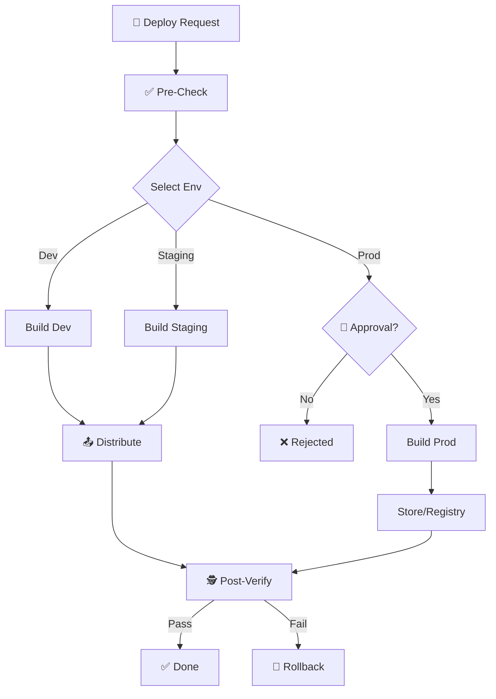

# 🚀 Deploy Application

**Objective:** Guide safe build and deploy process with version control and rollback plan for **[Detected Tech Stack]**.

## 🖼️ Process Flow

## ⚠️ Prerequisites

> [!IMPORTANT]
> Before deploying, ensure `/prepare-release` checklist is complete.

**Required checks:**
- [ ] Code merged to target branch (develop/main).
- [ ] All tests passed (CI/CD check).
- [ ] Version bumped (in `pubspec.yaml`, `package.json`, `pom.xml`, etc.).
- [ ] CHANGELOG.md updated.

## 🎯 Environment Selection

| Environment | Branch | Purpose | Auto/Manual |
|:--|:--|:--|:--:|
| **Development** | `develop` | Internal testing | Auto |
| **Staging** | `release/*` | UAT, Client preview | Manual |
| **Production** | `main` | End users | Manual + Approval |

## 🚀 Deployment Steps

### 1. Build Application

**AI Action:** Detect build commands from `PROJECT.md`, `Makefile`, `package.json`, or `pyproject.toml`.

*Examples:*
*   **Flutter:** `flutter build apk --flavor dev`, `flutter build ipa --release`
*   **Node.js:** `npm run build:dev`, `npm run build`
*   **Python:** `docker build -t app:dev .`, `python setup.py sdist`
*   **Go:** `go build -o bin/app ./cmd/app`

### 2. Verify Build Artifacts
- [ ] File size reasonable (no sudden increase).
- [ ] Version number matches the tag.
- [ ] Environment variables injected correctly (Config/Secrets).

### 3. Upload & Distribute

**Select Target based on Stack:**

#### Mobile (Flutter/React Native/iOS/Android)
- **Dev/Staging:** Firebase App Distribution, TestFlight.
- **Production:** Google Play Console, App Store Connect.

#### Web (React/Vue/Angular/Next.js)
- **Dev/Staging:** Vercel Preview, Netlify Draft, S3 Dev Bucket.
- **Production:** Vercel Production, Netlify Prod, AWS CloudFront.

#### Backend/Service (Node/Python/Go)
- **Container:** Docker Hub, AWS ECR, Google GCR.
- **Server:** Kubernetes (Helm upgrade), AWS ECS, Heroku, VPS (systemd).

### 4. Post-Deploy Verification
- [ ] App/Site accessible (Health Check endpoint 200 OK).
- [ ] Smoke test main features.
- [ ] Check crash logs (Sentry / Crashlytics / Datadog).
- [ ] Monitor API error rates and Latency.

## 🔄 Rollback Plan

If critical issues found after deploy:

### Immediate Actions
1. **Halt Distribution:** Stop distributing new version / drain traffic.
2. **Notify Team:** Alert about incident.
3. **Assess Impact:** Evaluate affected users.

### Rollback Steps
*   **Mobile:** Revert to previous version code -> Build -> Upload with higher version number.
*   **Web/Backend:** `git checkout tags/v{PREVIOUS_VERSION}` -> Redeploy OR `kubectl rollback`.

## 💡 AI Guidelines

**Language:** All responses and reports must be in **English**.
- **Context Aware:** Only show steps relevant to the current project's Tech Stack.
- **Safety:** Always remind user about rollback plan.
- **Version Control:** Check for version mismatches before proceeding.
- **Log:** Log all deployments to CHANGELOG.
