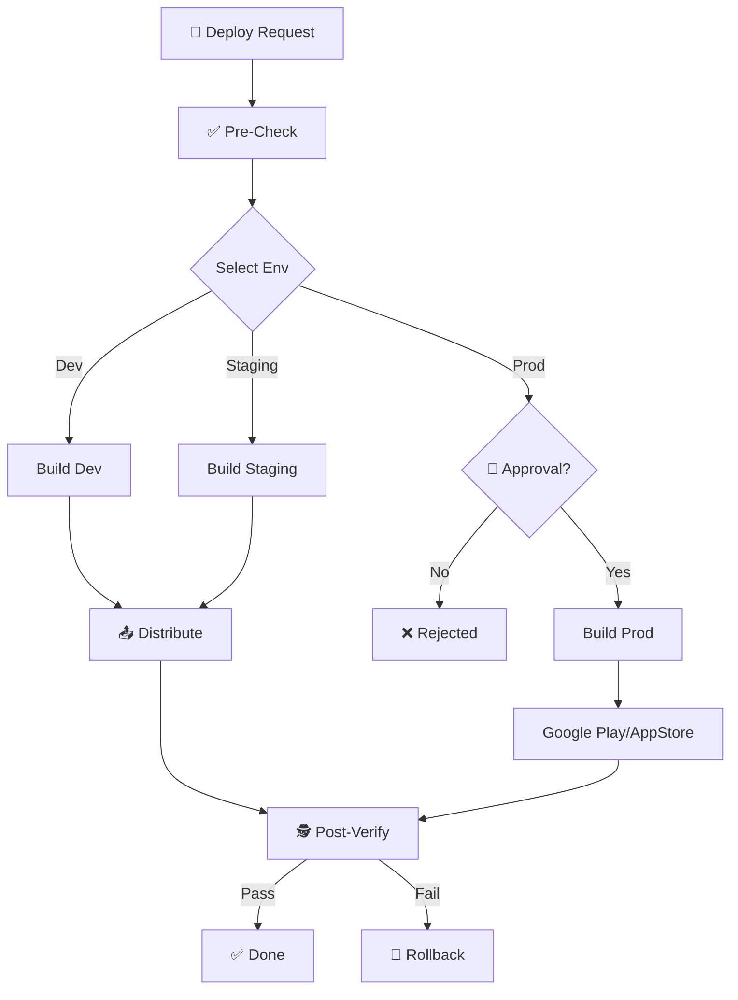

# 🚀 Deploy Application

**Mục tiêu:** Hướng dẫn quy trình build và deploy ứng dụng an toàn, có kiểm soát version và rollback plan.

## 🖼️ Quy trình (Process Flow)



## ⚠️ Điều kiện Tiên quyết (Prerequisites)

> [!IMPORTANT]
> Trước khi deploy, đảm bảo đã hoàn thành checklist `/prepare-release`

**Kiểm tra bắt buộc:**
- [ ] Code đã merge vào branch target (develop/main)
- [ ] Tất cả tests passed (`make test`)
- [ ] Version đã được bump (pubspec.yaml)
- [ ] CHANGELOG.md đã cập nhật

## 🎯 Chọn Môi Trường (Environment Selection)

| Môi trường | Branch | Mục đích | Auto/Manual |
|:--|:--|:--|:--:|
| **Development** | `develop` | Internal testing | Auto |
| **Staging** | `release/*` | UAT, Client review | Manual |
| **Production** | `main` | End users | Manual + Approval |

## 🚀 Các bước Deploy

### 1. Build Application

```bash
# Development
make build-dev

# Staging  
make build-staging

# Production
make build-prod
```

### 2. Verify Build Artifacts
- [ ] APK/IPA size hợp lý (không tăng đột biến)
- [ ] Version number đúng
- [ ] Bundle ID/Package name đúng môi trường

### 3. Upload & Distribute

#### Android
```bash
# Firebase App Distribution (Dev/Staging)
make distribute-android ENV=staging

# Google Play (Production)
make upload-playstore TRACK=internal
```

#### iOS
```bash
# TestFlight (Dev/Staging)
make distribute-ios ENV=staging

# App Store (Production)
make upload-appstore
```

### 4. Post-Deploy Verification
- [ ] App có thể download và cài đặt
- [ ] Smoke test các tính năng chính
- [ ] Kiểm tra crash logs (Firebase Crashlytics)
- [ ] Monitor API errors

## 🔄 Rollback Plan

Nếu phát hiện lỗi nghiêm trọng sau deploy:

### Immediate Actions
1. **Halt Distribution:** Tạm dừng phân phối bản mới
2. **Notify Team:** Alert về incident
3. **Assess Impact:** Đánh giá số users bị ảnh hưởng

### Rollback Steps
```bash
# Revert to previous version
git checkout tags/v{PREVIOUS_VERSION}
make build-prod
make upload-playstore TRACK=production --rollout=100
```

## 📊 Deployment Checklist

### Pre-Deploy
- [ ] Feature complete và tested
- [ ] No blocking bugs
- [ ] Release notes prepared
- [ ] Stakeholder approval (Production only)

### Post-Deploy
- [ ] Verify installation
- [ ] Smoke tests passed
- [ ] No spike in crash rate
- [ ] Tag release in Git

## 💡 Hướng dẫn cho AI

- Không tự động deploy Production - chỉ hướng dẫn steps
- Luôn nhắc user về rollback plan
- Kiểm tra version mismatch trước khi proceed
- Log mọi deployment vào CHANGELOG
